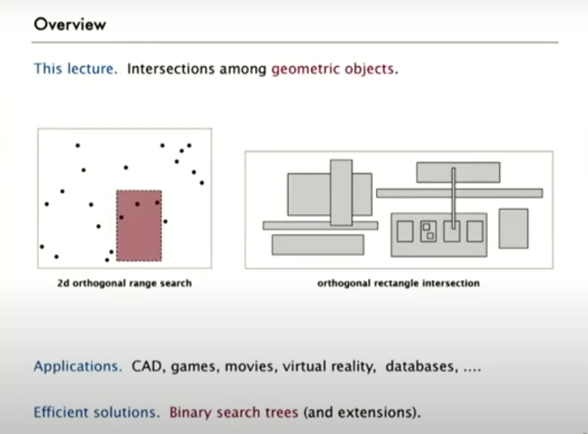
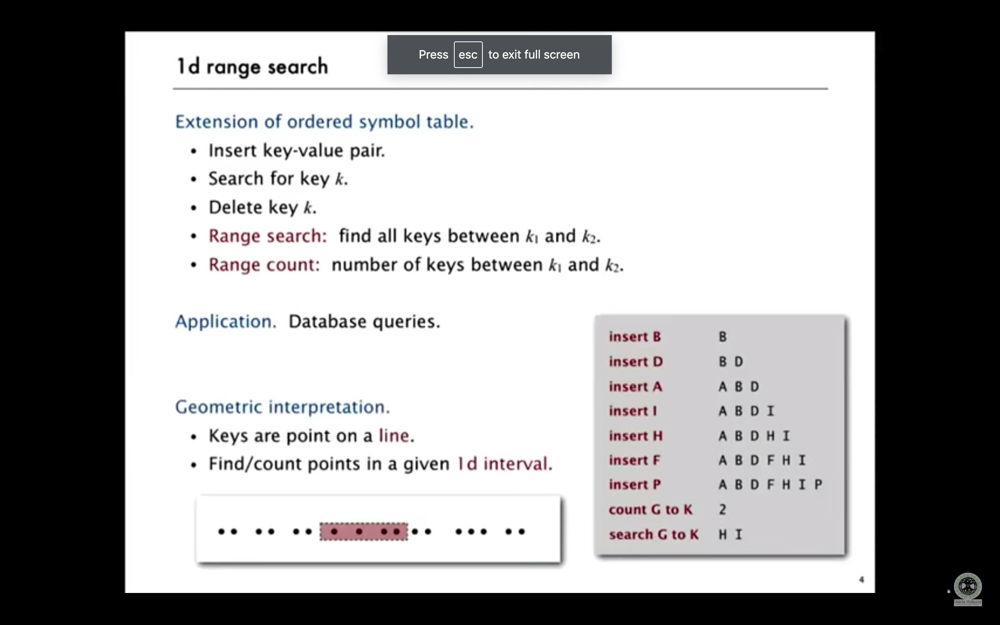
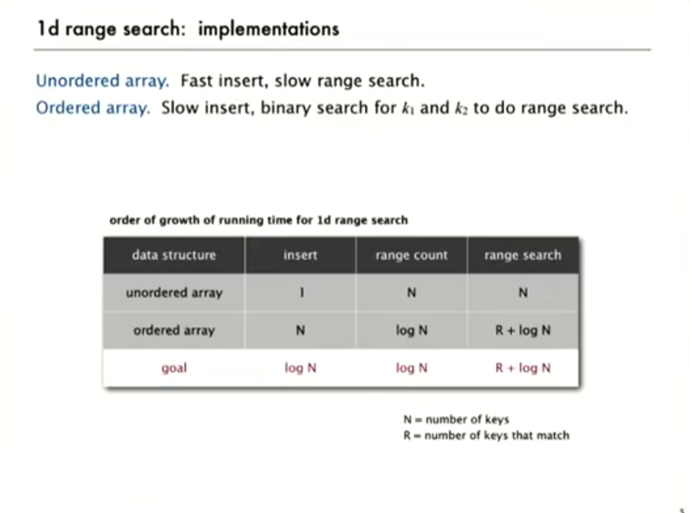
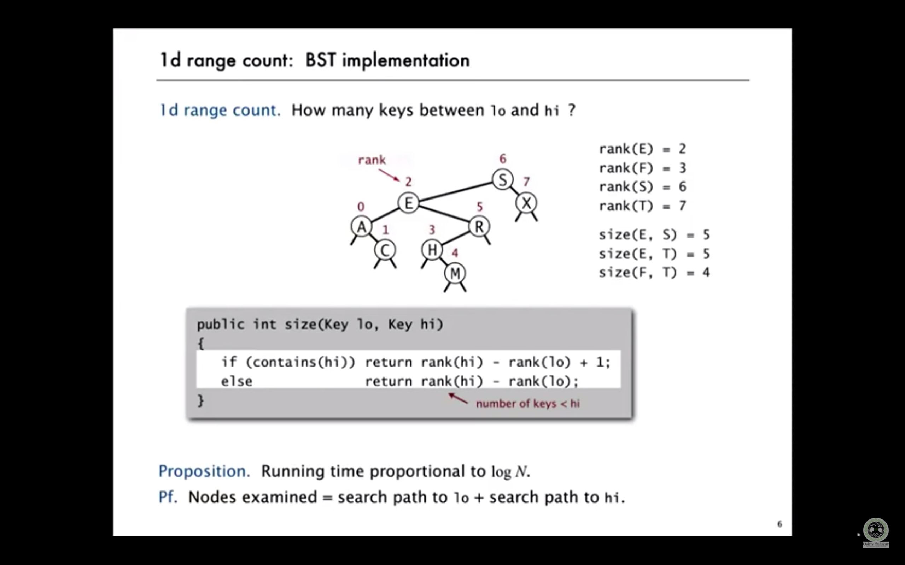
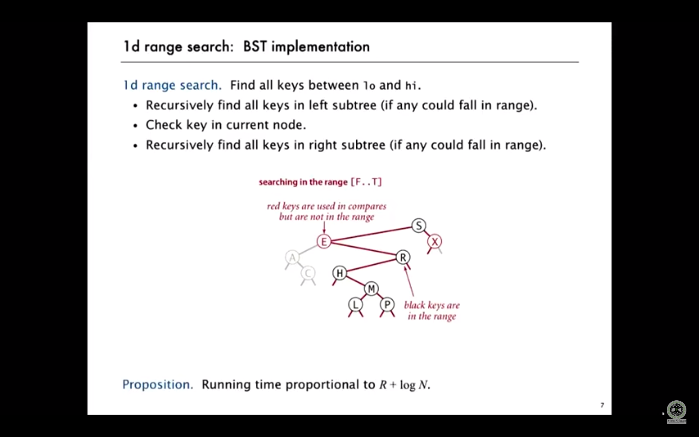

# Range search overview

## 1d range search

## 1d range search implementation

## 1d range count using BST

## 1d range search using BST

## Problems
https://leetcode.com/problems/range-sum-of-bst/

https://leetcode.com/problems/lowest-common-ancestor-of-a-binary-search-tree/

# Prefix sum
https://github.com/dilipkumar2k6/prefix-sum

# Sparse Table
https://github.com/dilipkumar2k6/sparse-table
# Segment Tree
https://github.com/dilipkumar2k6/segment-tree
# Binary uplifting
https://github.com/dilipkumar2k6/binary-uplifting

